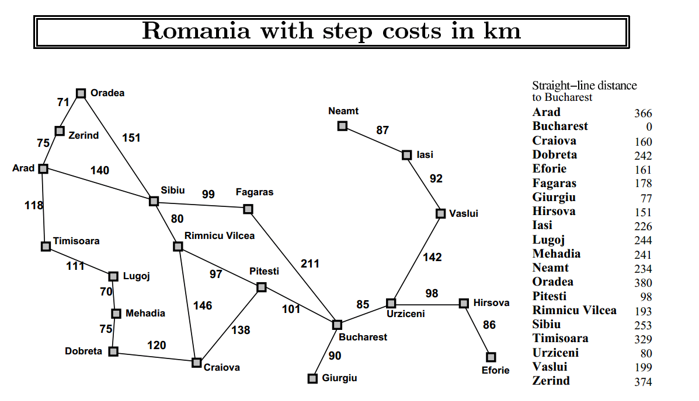

# Informed Search

Informed Search uses **additional knowledge about the problem** to guide the search toward the goal. This knowledge is usually represented by a **heuristic function**, which estimates the cost or distance from a state to the goal.

Common informed search algorithms include:

* Greedy Best-First Search
* A* Search
* Hill Climbing
* Beam Search

A well-designed heuristic can significantly reduce the number of states explored compared with uninformed search.

A common example is the **Romania Route Finding Problem**, where cities are represented as nodes and roads as connections. Heuristics such as the straight-line distance to **Bucharest** can be used to guide algorithms such as A* toward the destination.

